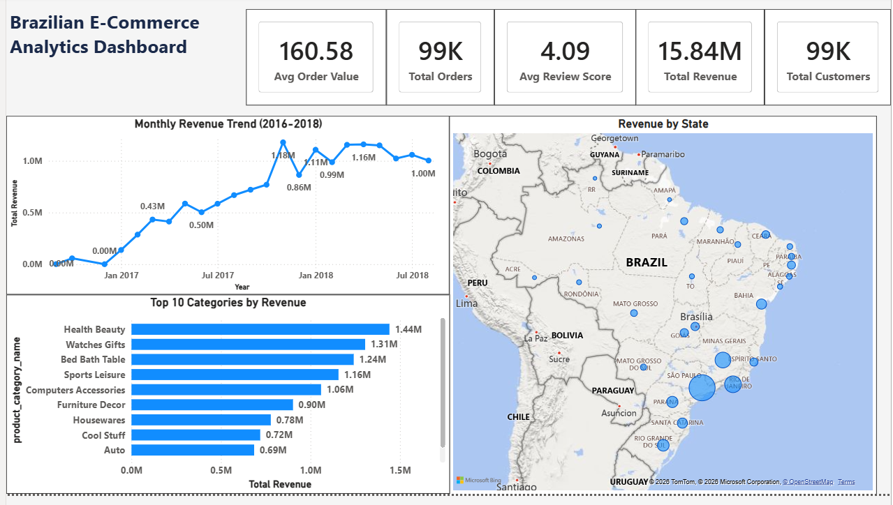
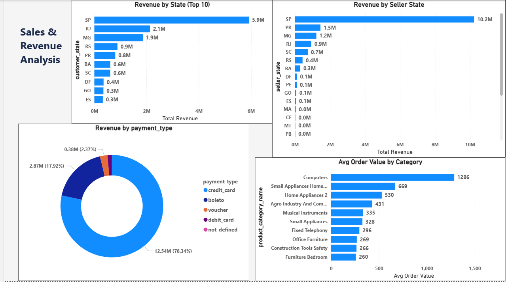
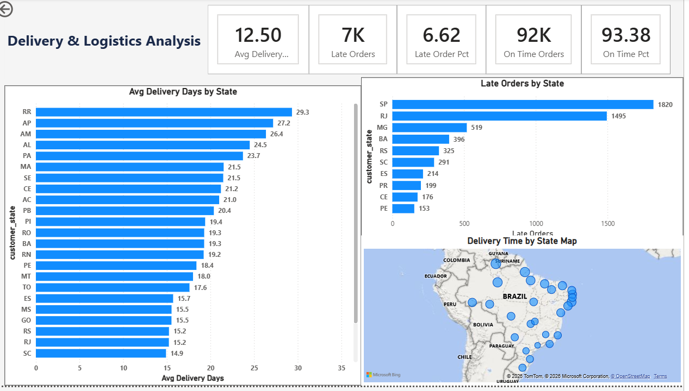
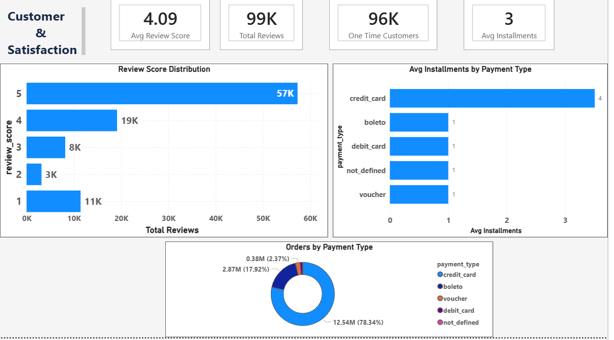

# 🛒 Brazilian E-Commerce Analytics | End-to-End Data Analysis Project

## 📌 Project Overview

This project performs a complete end-to-end data analysis on the 
**Olist Brazilian E-Commerce dataset** — one of the most comprehensive 
e-commerce datasets available on Kaggle, covering **99,441 orders** 
placed between **September 2016 and August 2018**.

The analysis covers the full data analyst workflow:
**Data Cleaning → Exploratory Data Analysis → SQL Analysis → Power BI Dashboard**

---
## 📸 Dashboard Preview

### Page 1 — Executive Overview


### Page 2 — Sales & Revenue Analysis


### Page 3 — Delivery & Logistics


### Page 4 — Customer & Satisfaction


---

## 🛠️ Tech Stack

| Tool | Purpose |
|------|---------|
| Python (Pandas, Matplotlib) | Data cleaning & EDA |
| MySQL | Database design & SQL analysis |
| Power BI | Interactive dashboard |
| SQLAlchemy | Python-MySQL connection |
| VS Code / Jupyter Notebook | Development environment |

---

## 📂 Project Structure
```
brazilian-ecommerce-analysis/
├── notebooks/
│   └── brazil_ecommerce_cleaning_eda.ipynb  # Data cleaning & EDA
├── sql/
│   ├── brazil_business_questions.sql         # 10 business questions
│   └── results/                              # Query output CSVs
│       ├── q01_overall_business_overview.csv
│       ├── q02_revenue_by_state.csv
│       ├── q03_top_categories_by_revenue.csv
│       ├── q04_monthly_revenue_trend.csv
│       ├── q05_delivery_time_by_state.csv
│       ├── q06_payment_type_analysis.csv
│       ├── q07_review_score_by_category.csv
│       ├── q08_top_sellers_by_revenue.csv
│       ├── q09_late_deliveries_by_state.csv
│       └── q10_repeat_customers.csv
├── images/
│   ├── eda_overview.png
│   └── monthly_trend.png
├── powerbi/
│   └── brazil_ecommerce_dashboard.pbix
└── README.md
```

---

## 📊 Dataset Information

- **Source:** [Olist Brazilian E-Commerce - Kaggle](https://www.kaggle.com/datasets/olistbr/brazilian-ecommerce)
- **Period:** September 2016 — August 2018
- **Tables:** 9 raw CSV files → 7 cleaned tables loaded into MySQL

| Table | Rows |
|-------|------|
| orders | 99,441 |
| order_items | 112,650 |
| customers | 99,441 |
| payments | 103,886 |
| products | 32,949 |
| sellers | 3,095 |
| reviews | 99,224 |

---

## 🔍 Phase 1 — Data Cleaning

Performed in Python using Pandas:

- Handled null values across all 7 tables
- Converted datetime columns to proper format
- Translated 71 product categories from Portuguese to English
- Removed duplicate records
- Standardized column naming conventions
- Saved 7 cleaned CSV files for MySQL loading

---

## 📈 Phase 2 — Exploratory Data Analysis

Key statistics discovered:

| Metric | Value |
|--------|-------|
| Total Orders | 99,441 |
| Total Revenue | R$15.84M |
| Avg Order Value | R$159.83 |
| Avg Review Score | 4.09 / 5.0 |
| Delivery Success Rate | 97% |
| Top State | São Paulo (42% of orders) |
| Top Category | Health Beauty |
| Peak Month | November 2017 (Black Friday) |

**Business grew 100x in one year** — from 1 order in Sep 2016 
to over 7,000 orders/month by late 2017.

---

## 🗄️ Phase 3 — SQL Analysis

Designed and queried a **7-table relational database** in MySQL.
Used advanced SQL techniques including:

- ✅ Multi-table JOINs (up to 4 tables)
- ✅ CTEs (Common Table Expressions)
- ✅ Window Functions (LAG, DENSE_RANK, OVER())
- ✅ Date Functions (DATEDIFF, DATE_FORMAT)
- ✅ Aggregate Functions with CASE WHEN
- ✅ Percentage calculations using window functions

### 10 Business Questions Answered:

| # | Question | Key Finding |
|---|----------|-------------|
| Q1 | Overall business overview | R$15.4M revenue, 96K orders |
| Q2 | Revenue by state | SP = 37% of total revenue |
| Q3 | Top categories by revenue | Health Beauty #1 at R$1.4M |
| Q4 | Monthly revenue trend | 100x growth in 12 months |
| Q5 | Delivery time by state | RR slowest at 29 days avg |
| Q6 | Payment type analysis | Credit card = 78% of revenue |
| Q7 | Review score by category | Mostly 4-5 stars across categories |
| Q8 | Top sellers by revenue | SP sellers dominate at R$10.2M |
| Q9 | Late deliveries by state | Only 6.62% late delivery rate |
| Q10 | Repeat customers | 0% — every customer ordered once |

---

## 📊 Phase 4 — Power BI Dashboard

Built a **4-page interactive dashboard** connecting directly to MySQL:

### Page 1 — Executive Overview
- 5 KPI cards (Revenue, Orders, Customers, Avg Value, Review Score)
- Monthly revenue trend line chart (2016-2018)
- Revenue by state bubble map
- Top 10 categories horizontal bar chart

### Page 2 — Sales & Revenue Analysis
- Revenue by customer state (Top 10)
- Revenue by seller state
- Payment type donut chart
- Avg order value by category

### Page 3 — Delivery & Logistics Analysis
- 5 KPI cards (Avg Days, Late Orders, Late %, On Time Orders, On Time %)
- Avg delivery days by state
- Late orders by state
- Delivery time map (bubble size = avg days)

### Page 4 — Customer & Satisfaction
- 4 KPI cards (Avg Score, Total Reviews, One Time Customers, Avg Installments)
- Review score distribution
- Avg installments by payment type
- Orders by payment type donut

---

## 💡 Key Business Insights

### 🗺️ Geography
- **São Paulo dominates** — 42% of customers, 37% of revenue
- **Southeast Brazil** (SP, RJ, MG) = 66% of all orders
- **North/Amazon region** has slowest delivery (RR: 29 days vs SP: 8.7 days)

### 💳 Payment Behavior
- **Credit card = 78%** of all revenue — dominant payment method
- **Boleto = 18%** — uniquely Brazilian bank slip payment method
- **Average 3 installments** — Brazilians love paying in parcelas!
- Only credit card users pay in installments (avg 4 months)

### ⭐ Customer Satisfaction
- **4.09/5 average** review score — generally satisfied customers
- **57% give 5 stars** but **11% give 1 star** — polarized behavior!
- More 1-star reviews than 2 or 3-star combined — love it or hate it!

### 🚚 Delivery Performance
- **93.38% on-time** delivery rate — strong operational performance
- North/Amazon states consistently slowest and most late
- **Geography drives delivery time** — distance from SP warehouses

### 📉 Customer Retention
- **0% repeat customers** — every customer ordered exactly once
- Business relies entirely on new customer acquisition
- Strong opportunity for loyalty program implementation

---

## 📋 Business Recommendations

### 1. 🎯 Customer Retention Program
**Problem:** 0% repeat customers — every customer orders exactly once  
**Recommendation:** Implement a loyalty rewards program  
- Offer discount vouchers after first purchase  
- Send personalized email campaigns based on category preferences  
- Target SP, RJ, MG customers first — highest volume states  
**Expected Impact:** Even 10% repeat rate = R$1.5M additional revenue

### 2. 🚚 Delivery Improvement — North Region
**Problem:** RR, AP, AM averaging 26-29 days delivery  
**Recommendation:** Partner with regional logistics providers  
- Establish regional warehouses in Manaus (AM)  
- Negotiate with local carriers for Amazon region  
- Set realistic delivery estimates for northern customers  
**Expected Impact:** Reduce north region delivery time by 30-40%

### 3. ⭐ Review Score Improvement
**Problem:** 11K 1-star reviews — more than 2 and 3 star combined  
**Recommendation:** Investigate root cause of 1-star reviews  
- Analyze if 1-star reviews correlate with late deliveries  
- Identify which sellers have most 1-star reviews  
- Implement seller performance monitoring system  
**Expected Impact:** Improve avg score from 4.09 to 4.3+

### 4. 💳 Payment Diversification
**Problem:** 78% credit card dependency — risk concentration  
**Recommendation:** Promote alternative payment methods  
- Offer discounts for Pix payments (instant Brazilian payment)  
- Promote boleto for customers without credit cards  
- Expand debit card acceptance — currently only 1.47%  
**Expected Impact:** Reach underbanked Brazilian population

### 5. 🗺️ Geographic Expansion
**Problem:** Southeast Brazil = 66% of revenue — concentration risk  
**Recommendation:** Target underserved regions  
- Marketing campaigns targeting Northeast states (BA, CE, PE)  
- Partner with local influencers in underserved states  
- Offer free shipping promotions for new regions  
**Expected Impact:** Reduce SP dependency from 42% to 35%

### 6. 📦 Seller Development
**Problem:** SP sellers = R$10.2M — 90% of top seller revenue  
**Recommendation:** Diversify seller base geographically  
- Recruit quality sellers from PR, MG, RJ  
- Offer onboarding support for sellers outside SP  
- Create regional seller incentive programs  
**Expected Impact:** Improve delivery times for non-SP customers
```

---

## 🚀 How to Run This Project

### Python/Jupyter:
```bash
pip install pandas matplotlib sqlalchemy mysql-connector-python
jupyter notebook notebooks/brazil_ecommerce_cleaning_eda.ipynb
```

### MySQL:
```sql
CREATE DATABASE brazil_ecommerce;
-- Run the notebook to load all 7 tables
-- Then open sql/brazil_business_questions.sql
```

### Power BI:
```
Open powerbi/brazil_ecommerce_dashboard.pbix
Connect to your local MySQL instance
Refresh data
```

---

## 👩‍💼 About This Project

This project was built **independently** without following a course or 
tutorial — every design decision, debugging challenge, and analytical 
insight was developed through original thinking and problem-solving.

Combined with **14 years of professional experience** in HR, compliance, 
and supply chain, this analysis reflects both technical data skills and 
real business intuition.

---

## 📬 Connect

**LinkedIn:** [LinkedIn URL]  
**GitHub:** [https://github.com/vrasup/brazilian-ecommerce-analysis]

---

